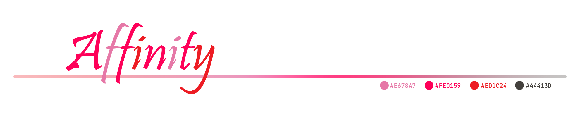
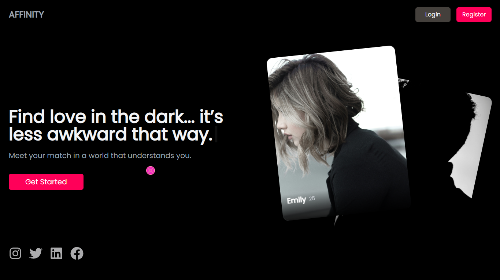
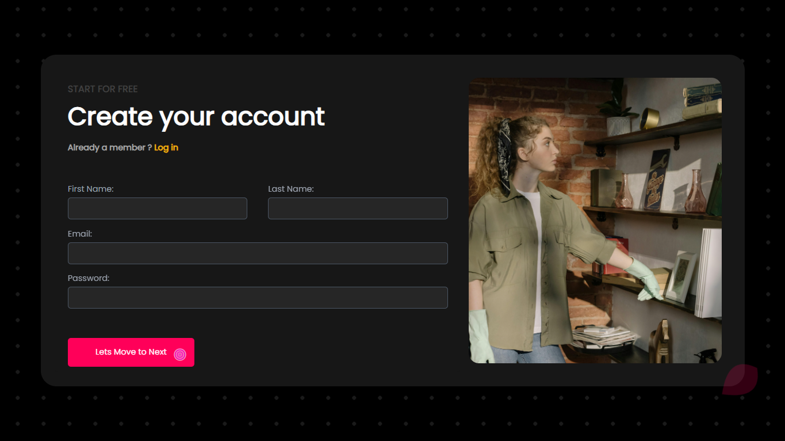
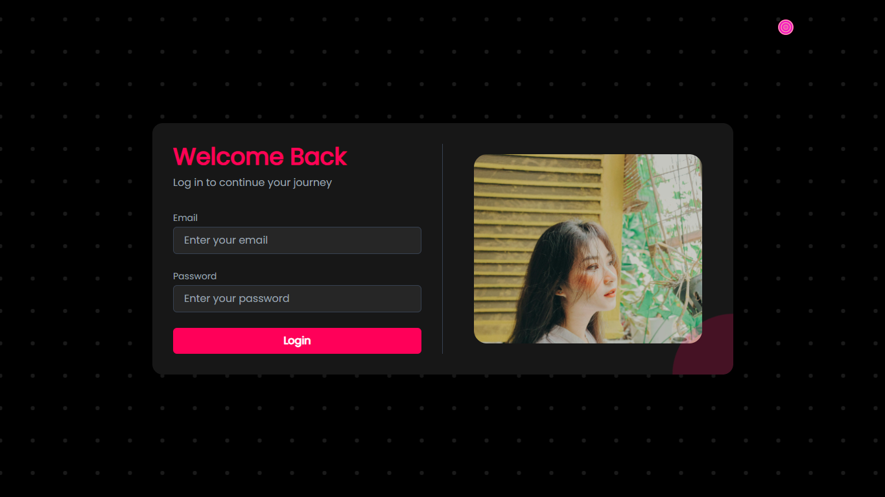
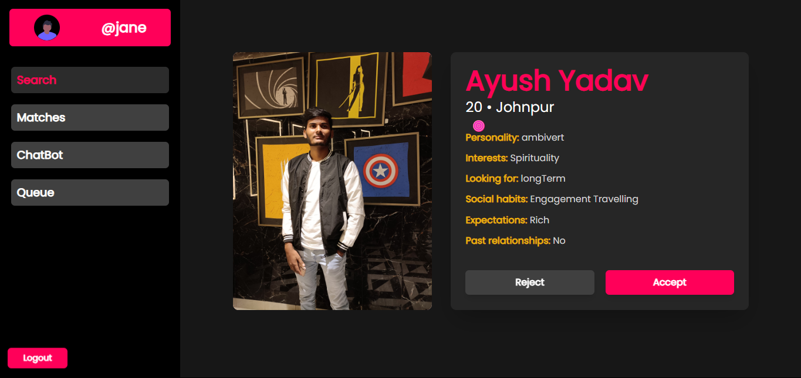

<br>

Welcome to the **Affinity Frontend Repository**!
This project is part of the larger Affinity platform, focused specifically on frontend development. **Affinity** is a web application designed to connect individuals with similar intellectual levels. The platform leverages an AI-powered chatbot for matchmaking and features various interactive games, such as coding challenges, to match users based on their skill sets. Once matched, users can engage in meaningful conversations, fostering deep intellectual connections.

If you're interested in contributing to the backend of the project, please visit our *[Affinity Backend Repository](https://github.com/Sidharth-Singh10/Affinity-backend)*.


<p align="center"><br><br>
<a href="#introduction"><kbd><br>&emsp;Introduction&emsp;<br><br></kbd></a>&emsp;
<a href="#features"><kbd><br>&emsp;Features&emsp;<br><br></kbd></a>&emsp;
<a href="#preview"><kbd><br>&emsp;Preview&emsp;<br><br></kbd></a>&emsp;
<a href="#technologies-used"><kbd><br>&emsp;Technologies Used&emsp;<br><br></kbd></a>&emsp;
<a href="#installatiom"><kbd><br>&emsp;Installatiom&emsp;<br><br></kbd></a>
<br>
<br>
<a href="#usage"><kbd><br>&emsp;Usage&emsp;<br><br></kbd></a>&emsp;
<a href="#contibutors"><kbd><br>&emsp;Contibutors&emsp;<br><br></kbd></a>&emsp;
<a href="#contibuting"><kbd><br>&emsp;Contibuting&emsp;<br><br></kbd></a>&emsp;
<a href="#contact"><kbd><br>&emsp;Contact&emsp;<br><br></kbd></a><br><br>
</p>

## Introduction

The Affinity Frontend is a React-based application designed to deliver a smooth and seamless user experience. This repository houses all the code related to the frontend portion of the Affinity project, and all contributions should be focused on this area. The frontend interacts with the backend through API calls to provide matchmaking services, games, and chat functionality for users.

## Features

- User-friendly interface
- Responsive design
- Integration with backend APIs
- Routing with React Router


<div align="center"><table><h2 id="preview">Preview</h2><tr><td>
</td><td>
</td></tr><tr><td>
</td><td>
</td></tr></table></div>

## Technologies Used

- React
- React Router
- Axios
- CSS Modules

## Installation

To get started with the project, follow these steps:

1. Clone the repository:

    ```bash
    git clone https://github.com/rishyym0927/Affinity_frontend.git
    cd Affinity_frontend
    ```

2. Install dependencies:

    ```bash
    npm install
    ```
3. Even after running npm install, it may give an error while running that "dotenv is not defined".
Simply run :

   ```bash
   npm install dotenv
   ```
   Now you can re-run the server and this time it will run without any error.
   
> [!NOTE]
> *You don’t need environment variables to run the project since no environment variables are currently being used in the codebase. The project contains only the frontend code and all the data has been hardcoaded. However, the requirement to install `dotenv` exists due to the boilerplate code present in the `vite.config.js`, which includes the `dotenv` configuration. Aside from this boilerplate setup, there is no practical need for `dotenv` in the project at the moment.*


## Usage

To run the application locally, use the following command:

```bash
npm start
```

This will start the development server and you can view the application in your browser at `http://localhost:5173`.


- **public/**: Contains the static files.
- **src/**: Contains the source code for the application.
  - **assets/**: Contains images, fonts, and other static assets.
  - **components/**: Contains reusable React components.
  - **pages/**: Contains React components for different pages.
  - **App.js**: The main App component.
  - **index.js**: The entry point of the application.

> [!TIP]
> Users are informed that they have full control over the sample data present in *sampleData.js*, as it is hardcoded. Any modifications made will only affect your local codebase and will not impact other users.

### Routing

**Affinity** is currently under development, so navigation between pages is not yet fully implemented. As a result, there are no buttons or links to direct you to other sections of the platform. However, you can access different pages manually by appending the */* followed by respective *page-route* to the base URL.

<table align="center">
  <tr>
    <th> Page Name </th>
    <th>Route</th>
  </tr>
  <tr>
    <td>Landing</td>
    <td><a href="./src/pages/Landing.jsx">/</a></td>
  </tr>
  <tr>
    <td>Login</td>
    <td><a href="./src/pages/Login.jsx">/login</a></td>
  </tr>
  <tr>
    <td>Register</td>
    <td><a href="./src/pages/Register.jsx">/register</a></td>
  </tr>
  <tr>
    <td>Room Page</td>
    <td><a href="./src/pages/Room.jsx">/room/:roomId</a></td>
  </tr>
  <tr>
    <td>Code Run</td>
    <td><a href="./src/pages/CodeRun.jsx">/coderun</a></td>
  </tr>
  <tr>
    <td>Dashboard</td>
    <td><a href="./src/pages/Dashboard.jsx">/dashboard</a></td>
  </tr>
  <tr>
    <td>Matches</td>
    <td><a href="./src/pages/Matches.jsx">/matches</a></td>
  </tr>
  <tr>
    <td>Requests</td>
    <td><a href="./src/pages/Requests.jsx">/request</a></td>
  </tr>
  <tr>
    <td>Queue</td>
    <td><a href="./src/pages/Queue.jsx">/queue</a></td>
  </tr>
  <tr>
    <td>Chatbot</td>
    <td><a href="./src/pages/Chatbot.jsx">/chatbot</a></td>
  </tr>
  <tr>
    <td>Denied</td>
    <td><a href="./src/pages/Denied.jsx">/denied</a></td>
  </tr>
</table>


## Contibutors

<a href = "https://github.com/Tanu-N-Prabhu/Python/graphs/contributors">
  
</a>

## Contributing

We welcome contributions from the community! Please read our [`CONTRIBUTING.md`](command:_github.copilot.openRelativePath?%5B%7B%22scheme%22%3A%22file%22%2C%22authority%22%3A%22%22%2C%22path%22%3A%22%2Fc%3A%2FUsers%2FLenovo%2FOneDrive%2FDesktop%2FPRACTISE%2Fdfsdfs%2FAffinity_frontend%2FCONTRIBUTING.md%22%2C%22query%22%3A%22%22%2C%22fragment%22%3A%22%22%7D%2C%22e29a7936-4f33-4970-9e7f-3e2939a28627%22%5D "c:\Users\Lenovo\OneDrive\Desktop\PRACTISE\dfsdfs\Affinity_frontend\CONTRIBUTING.md") file for detailed guidelines on how to contribute to this project.

### Hacktoberfest and GSSoC 24

This repository is actively participating in Hacktoberfest and GSSoC 24. We welcome contributions, but please note that only frontend-related tasks are open for contribution. Any modifications or changes to the backend will not be considered. Feel free to raise issues and start working on assigned tasks.


## Contact

If you have any questions or need further assistance, feel free to open an issue or contact the maintainers.

Thank you for your contributions!


